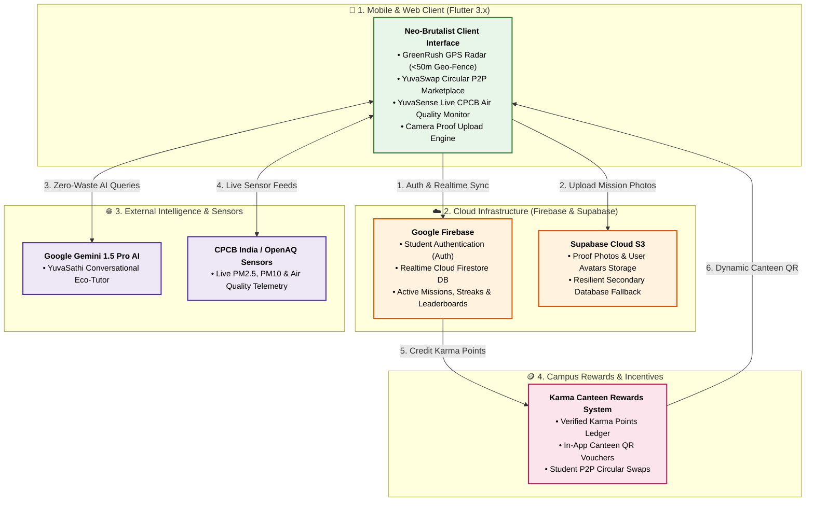
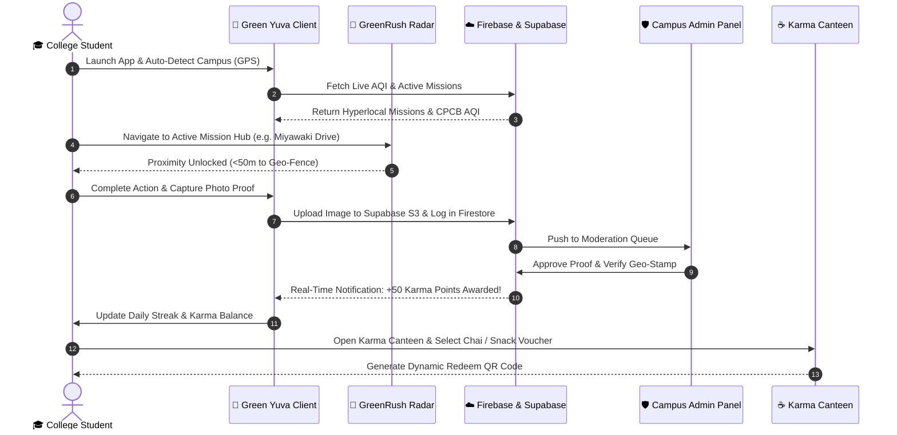

# 🌱 Green Yuva (ग्रीन युवा)
### *Youth-Led Climate Action & Campus Decarbonization Ecosystem*

<p align="center">
  
</p>

<p align="center">
  <a href="https://greenyuva-e56f6.web.app" target="_blank">
    
  </a>
  &nbsp;&nbsp;
  <a href="https://greenyuva-e56f6.firebaseapp.com" target="_blank">
    
  </a>
</p>

<p align="center">
  <a href="https://flutter.dev"></a>
  <a href="https://dart.dev"></a>
  <a href="https://firebase.google.com"></a>
  <a href="https://supabase.com"></a>
  <a href="https://ai.google.dev"></a>
  <a href="https://cpcb.nic.in"></a>
  <a href="LICENSE"></a>
</p>

> [!TIP]
> ### 🌿 About Green Yuva & Live Demo
> **Green Yuva** is an AI-powered, geofenced campus climate action platform & circular student economy. It empowers university students to engage in verified, real-world sustainability actions, trade academic essentials peer-to-peer on **YuvaSwap**, track live city air quality via **CPCB India telemetry**, chat with a cloud-based **Gemini 1.5 Pro climate tutor**, and earn tangible rewards at college cafeterias through the **Karma Points rewards system**.
> 
> 🚀 **[Launch Live Demo (greenyuva-e56f6.web.app)](https://greenyuva-e56f6.web.app)** &nbsp;|&nbsp; ⚡ **[Alternative Mirror (greenyuva-e56f6.firebaseapp.com)](https://greenyuva-e56f6.firebaseapp.com)**  
> *(PWA enabled: open in Safari on iPhone or Chrome on Android and tap **"Add to Home Screen"** to run full-screen)*

---

## 📌 Table of Contents
- [🌿 About Green Yuva](#-about-green-yuva--live-demo)
- [🌍 Vision & The Problem](#-vision--the-problem)
- [✨ Core Innovation Pillars](#-core-innovation-pillars)
- [🏛️ System Architecture](#️-system-architecture)
- [🔄 User Journey & Action Workflow](#-user-journey--action-workflow)
- [📱 Mobile App Showcase (15 Live Screens)](#-mobile-app-showcase)
- [🛠️ Technology Stack & Ecosystem](#️-technology-stack--ecosystem)
- [🔐 Multi-Cloud & Security Architecture](#-multi-cloud--security-architecture)
- [🚀 Installation & Getting Started](#-installation--getting-started)
- [🗺️ Campus Decarbonization Roadmap](#️-campus-decarbonization-roadmap)

---

## 🌍 Vision & The Problem

Across India's **40,000+ higher education institutions**, millions of students inhabit micro-cities that consume massive amounts of energy, generate metric tons of single-use waste, and face severe urban air quality hazards ($PM_{2.5}$ and $PM_{10}$).

While youth desire to participate in ecological stewardship, traditional climate initiatives suffer from three fatal friction points:
1. **The Intangibility Deficit**: Students cannot observe the localized, verifiable carbon impact of their daily choices.
2. **Missing Hyperlocal Incentives**: Eco-actions are treated as volunteer chores without gamified feedback, peer competition, or tangible campus utility.
3. **Linear Campus Consumption**: Textbooks, drafters, calculators, and lab gear are discarded at the end of each academic semester instead of circulating within the campus economy.

### 💡 The Green Yuva Solution
**Green Yuva** is a high-octane, gamified campus climate ecosystem engineered with a **Neo-Brutalist design language**. It bridges real-world physical eco-actions with digital verification, a verified **Karma Points rewards system**, live **Central Pollution Control Board (CPCB)** air monitoring, an **offline-first tactical campus radar (GreenRush)**, a circular student marketplace (**YuvaSwap**), and a cloud-powered AI climate tutor running Google Gemini 1.5 Pro (**YuvaSathi AI**).

```
   [ Real-World Student Eco Action ] 
                 ↓
  [ Geo-Fenced Proximity & Photo Proof ] 
                 ↓
  [ Dual-Engine Cloud Verification (Firebase + Supabase) ]
                 ↓
  [ Karma Points & Campus Streak Accrual ] 
                 ↓
  [ Campus Canteen Perks & YuvaSwap Circular Commerce ]
```

---

## ✨ Core Innovation Pillars

### 1. ⚡ GreenRush — Tactical Campus Eco-Radar
* **Hyperlocal GPS Geo-Fencing**: Interactive radar view pinpointing active campus decarbonization hubs (e.g., PCCOE, COEP, VIT, solar microgrids, compost facilities, Miyawaki forests).
* **Live Distance & Proximity Locking**: Missions unlock only when students are physically within the verified campus perimeter (<50 meters).
* **Camera Proof Verification**: Real-time snapshot submission with auto-queued offline upload resilience.

### 2. 🔄 YuvaSwap — Circular Campus Marketplace
* **Zero-Waste Student Economy**: Buy, sell, or donate pre-owned engineering drawing drafters, scientific calculators, lab aprons, and semester textbooks.
* **CO₂ & Landfill Diverted Metrics**: Every completed transaction computes kilograms of paper and carbon emissions diverted from urban landfills.
* **Direct In-App Chat & Safety**: Verified student-to-student exchange with designated campus meeting zones.

### 3. 📊 YuvaSense — Real-Time Indian Environmental Intelligence
* **Live CPCB India & OpenAQ Integration**: Real-time monitoring of $PM_{2.5}$, $PM_{10}$, $NO_2$, $SO_2$, and composite AQI for Indian metropolitan and tier-2 college hubs.
* **IMD Disaster Weather Warning Bulletins**: Early-warning alerts for Western Disturbances, flash floods, heatwaves, and seasonal smog spikes.
* **India Action Case Studies**: Curated deep-dives on national benchmarks—Rewa Ultra Mega Solar (MP), Indore Asia's Largest Bio-CNG Plant, and Sikkim's 100% Organic Farming Revolution.
* **Gamified Climate Quizzes**: Rapid-fire trivia modules covering Renewable Energy, SDG 13, Carbon Offsets, and Waste Segregation.

### 4. 🤖 YuvaSathi AI — Personalized Campus Eco-Tutor
* **Powered by Google Gemini 1.5 Pro**: Multimodal intelligence fine-tuned for college zero-waste living, recycling categorization, and carbon calculations.
* **Context-Aware Suggestions**: Recommends personalized campus missions based on the student's branch, hostel location, and daily commute pattern.

### 5. 🪙 Karma Canteen & Campus Rewards System
* **Tangible Utility for Climate Action**: Students redeem earned Karma Points for campus canteen meals, eco-store merchandise, cafeteria beverages, and university sustainability perks.
* **Daily Streak Multipliers**: Promotes sustained habit formation with milestone badges and university leaderboard rankings.

### 6. 🪪 Yuva GreenPassport™ — Verifiable MRV & NAAC 7.1 Transcript (Hero Feature)
* **Verifiable Digital MRV Credential**: Cryptographically signed student climate action transcript proving avoided $\text{CO}_2\text{e}$, landfill methane ($\text{CH}_4$) diverted, sapling survival stewardship, and low-exposure transit.
* **Instant Dynamic QR Verification**: Publicly auditable proof for corporate recruiters, LinkedIn credentials, and ESG placements.
* **Institutional NAAC Criterion 7.1 Engine**: 1-click audit dashboard calculating university compliance metrics for NAAC peer-review and NIRF institutional ratings.

---

## 🏛️ System Architecture



---

## 🔄 User Journey & Action Workflow



---

## 📱 Mobile App Showcase

Every screen in Green Yuva has been crafted with a distinctive **Neo-Brutalist UI**—featuring bold high-contrast strokes, vivid primary cards, tactile depth, and instant responsiveness.

### 🌟 Part 1: Home Dashboard, Live Notifications & Module Hubs
| 01. Home Dashboard & AQI | 02. Real-time Notifications | 03. Green Yuva Hubs |
| :---: | :---: | :---: |
|  |  |  |
| *Live CPCB AQI, active streak counter, Karma Points balance, and instant Canteen shortcuts.* | *Push alerts for verification approvals, university giveaways, and streak reminders.* | *Full navigation hub: YuvaSwap, GreenRush Radar, YuvaSense, and YuvaVibe.* |

---

### 🌟 Part 2: Campus Community, College Hubs & YuvaSwap
| 04. Community Actions | 05. YuvaVibe College Hubs | 06. YuvaSwap Marketplace |
| :---: | :---: | :---: |
|  |  |  |
| *Miyawaki afforestation, hostel compost drives, and solar audit community initiatives.* | *Pune regional engineering hubs: PCCOE, COEP Tech, and VIT Pune leaderboards.* | *Circular student exchange: Pre-owned gear, calculated CO₂ and landfill diversion.* |

---

### 🌟 Part 3: Swap Listings, GreenRush Radar & Live CPCB AQI
| 07. Post Swap Item | 08. GreenRush Tactical Radar | 09. YuvaSense CPCB AQI |
| :---: | :---: | :---: |
|  |  |  |
| *Publish textbooks, lab coats, and drafters with instant condition badges and pricing.* | *Neo-Brutalist GPS radar scanning campus missions with dynamic compass orientation.* | *Live Central Pollution Control Board telemetry: PM2.5, PM10, and health warnings.* |

---

### 🌟 Part 4: Interactive Quizzes, Disaster Bulletins & Indian Case Studies
| 10. Climate Quizzes | 11. IMD Disaster Tracker | 12. Indian Benchmark Cases |
| :---: | :---: | :---: |
|  |  |  |
| *Engaging climate challenges on carbon footprints, SDG 13, and solar photovoltaics.* | *Real-time IMD alert bulletins for Western Disturbances and smog flash-points.* | *National benchmarks: Rewa Solar Park, Indore Bio-CNG, and Sikkim 100% Organic.* |

---

### 🌟 Part 5: AI Climate Tutor, Campus Sprint & User Profile
| 13. YuvaSathi AI Tutor | 14. Campus Activities Sprint | 15. User Profile & Karma History |
| :---: | :---: | :---: |
|  |  |  |
| *Intelligent conversational assistant for campus zero-waste tips and project guidance.* | *PCCOE Pawana River Desilting Drive and Campus Solar Microgrid Audit tracks.* | *Eco Campus Champion rank, 100 Karma Points, achievement badges, and verified action history.* |

---

## 🛠️ Technology Stack & Ecosystem

<p align="center">
  
</p>

| Logo | Technology | Domain | Role & Implementation in Green Yuva |
| :---: | :--- | :--- | :--- |
|  | **Flutter 3.x** | Client Framework | Cross-platform multi-threaded native rendering for Android & iOS |
|  | **Dart 3.x** | Core Language | Sound null-safety, strong typing, asynchronous event loop & isolates |
|  | **Google Firebase** | Cloud Backend | Reactive Cloud Firestore NoSQL, Firebase Auth session lifecycle & push feeds |
|  | **Supabase Cloud** | Distributed Storage | S3-compatible cloud storage for `avatars`, `proofs`, and `swap_images` |
|  | **PostgreSQL** | Relational Store | Resilient relational fallback and high-throughput diagnostic telemetry store |
|  | **Google Gemini AI** | Artificial Intelligence | Multimodal reasoning engine for YuvaSathi AI campus conversational tutoring |
|  | **Google Maps & CPCB** | Geospatial & Telemetry | Live CPCB India & OpenAQ air quality telemetry + Google Maps SDK integration |
|  | **Android SDK** | Native OS Target | Material Neo-Brutalism system widgets, camera hardware & GPS sensor integration |
|  | **Apple iOS** | Native OS Target | Cupertino compatibility layer, location permissions & smooth 60fps animations |
|  | **Git & GitHub** | Source Control | Distributed version control, continuous verification & modular architecture |

---

## 🔐 Multi-Cloud & Security Architecture

### 1. Hybrid Dual-Engine Cloud Pipeline
Green Yuva implements an enterprise-grade **multi-cloud hybrid architecture**:
* **Sub-Second Real-Time Synchronization**: Firebase Cloud Firestore manages reactive state changes (leaderboard rankings, Karma Points balances, instant notifications, and moderation queues) with continuous WebSocket listeners.
* **Distributed Binary Storage**: Supabase S3 handles large multi-part media uploads across isolated buckets:
  * `avatars`: User profile pictures with automatic public CDN edge caching.
  * `proofs`: Geo-tagged mission verification images submitted by students.
  * `swap_images`: Multi-photo student marketplace item listings.

### 2. High-Availability Offline Resilience
Campus life frequently involves subterranean classrooms, workshops, and basements with poor cellular reception. Green Yuva's `OfflineCacheService` guarantees seamless operation:
* **Optimistic Local Storage**: Mission lists, CPCB AQI snapshots, and quiz questions are cached locally via `SharedPreferences` and in-memory caches.
* **Pending Submission Queue**: When actions or proofs are submitted offline, they are automatically held in a local FIFO queue and pushed to the cloud backend as soon as connectivity is restored.

---

## 🚀 Installation & Getting Started

### Prerequisites
* **Flutter SDK**: `>=3.19.0`
* **Dart SDK**: `>=3.3.0`
* **Android Studio / VS Code** with Flutter and Dart extensions
* An active **Firebase Project** (`google-services.json` in `android/app/`)
* An active **Supabase Project** with buckets: `avatars`, `proofs`, `swap_images`

### 1. Clone the Repository
```bash
git clone https://github.com/madhavzanwar/green-yuva.git
cd green-yuva
```

### 2. Install Dependencies
```bash
flutter pub get
```

### 3. Configure Environment Credentials
Create a `.env` file in the root directory (or inject via `--dart-define`):
```env
SUPABASE_URL=https://your-project.supabase.co
SUPABASE_ANON_KEY=your-supabase-anon-key
GEMINI_API_KEY=your-google-gemini-api-key
```

### 4. Run Static Analysis & Code Verification
```bash
dart analyze lib
```

### 5. Launch Application
```bash
# Debug run on connected Android device or emulator
flutter run

# Build production release APK
flutter build apk --release
```

---

## 🗺️ Campus Decarbonization Roadmap

- [x] **Phase 1: Foundation & Identity** — Complete Neo-Brutalist design overhaul, Green Yuva brand identity, and multi-cloud sync.
- [x] **Phase 2: Hyperlocal GreenRush Radar** — GPS-enabled tactical radar with geo-fenced campus mission hubs.
- [x] **Phase 3: YuvaSwap Circular Marketplace** — Student-to-student exchange with automated CO2 savings algorithms.
- [x] **Phase 4: YuvaSense & Real-Time CPCB AQI** — Central Pollution Control Board live telemetry and IMD disaster warnings.
- [x] **Phase 5: Karma Canteen & Rewards System** — Real-world perks and vouchers redeemable at college cafeterias.
- [ ] **Phase 6: Multi-University Inter-Campus League** — State-level leaderboards comparing carbon offsets between institutions.
- [ ] **Phase 7: IoT Smart Bin Integration** — NFC/QR-enabled smart waste bins that instantly award Karma Points upon verified e-waste disposal.

---

<p align="center">
  <b>Built with 💚 for India's Youth & A Sustainable Tomorrow.</b><br/>
  <sub>Released under the MIT License.</sub>
</p>
